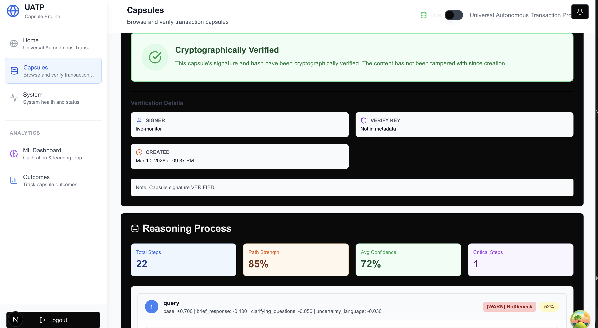

# UATP

**Cryptographic audit trails for AI decisions.**

[](https://github.com/KayronCalloway/uatp/actions/workflows/ci.yml)
[](https://pypi.org/project/uatp/)
[](https://www.python.org/downloads/)
[](https://opensource.org/licenses/MIT)
[](STATUS.md)

> **Current state: Beta.** Core signing, verification, and SDK are production-ready. Hosted SaaS is in progress. Not yet independently audited. See [STATUS.md](STATUS.md) for details.

---

## What It Does

UATP creates verifiable capsules for AI reasoning: cryptographically signed records that prove what decision was made, with what reasoning, at what time.

- **Ed25519 + ML-DSA-65 signatures** — tamper-evident, quantum-resistant, user-controlled keys
- **RFC 3161 timestamps** — external time authority (DigiCert)
- **DSSE bundles** — Sigstore-compatible portable verification
- **Verified context retrieval** — search capsules with verification status for trusted RAG applications
- **Zero-trust architecture** — designed so private keys remain on your device ([how this works](TRUST_MODEL.md))
- **Standalone verification** — verify independently without relying on UATP servers ([verification details](TRUST_MODEL.md#verification))


*A verified capsule showing reasoning process, confidence metrics, and cryptographic verification status.*

---

## Quick Start

### 1. Install the SDK

```bash
pip install uatp
```

### 2. Start the backend (if running locally)

```bash
git clone https://github.com/KayronCalloway/uatp.git
cd uatp
pip install -e .
python run.py
```

### 3. Create a capsule

```python
from uatp import UATP

client = UATP()  # Connects to localhost:8000
result = client.certify(
    task="Loan decision",
    decision="Approved for $50,000 at 5.2% APR",
    reasoning=[
        {"step": 1, "thought": "Credit score 720 (excellent)", "confidence": 0.95},
        {"step": 2, "thought": "Debt-to-income 0.28 (acceptable)", "confidence": 0.90}
    ]
)

print(f"Capsule ID: {result.capsule_id}")
print(f"Verified: {client.get_proof(result.capsule_id).verify()}")
```

Full setup: [SDK Quickstart](sdk/python/QUICKSTART.md)

---

## Start Here

| Goal | Path |
|------|------|
| **Try it locally** | [Quick Start](#quick-start) → [Examples](examples/) |
| **Inspect the crypto** | [Trust Model](TRUST_MODEL.md) → [src/crypto/](src/crypto/) |
| **Integrate the SDK** | [SDK Docs](sdk/python/README.md) → [API Reference](docs/api-documentation.md) |
| **Understand the vision** | [Vision](docs/vision.md) → [Complete Vision](docs/UATP_COMPLETE_VISION.md) |
| **Navigate the codebase** | [Repository Map](docs/repository-map.md) |

---

## Architecture

```
uatp/
├── src/
│   ├── api/            # FastAPI backend
│   ├── attestation/    # Workflow attestation (in-toto style)
│   ├── cli/            # CLI tools (verify, export, inspect)
│   ├── crypto/         # Key management
│   ├── export/         # DSSE bundle export (Sigstore style)
│   ├── live_capture/   # Real-time capture with feedback signal detection
│   ├── schema/         # Schema definitions and facets
│   ├── security/       # Ed25519/ML-DSA signatures, RFC 3161
│   └── services/       # Search, lifecycle services
├── sdk/python/         # Python SDK
├── frontend/           # Next.js dashboard (beta)
├── tests/              # 1400+ tests
└── infra/              # Docker, Kubernetes configs
```

Full structure with audit priorities: [Repository Map](docs/repository-map.md)

**Security documentation:**
- [TRUST_MODEL.md](TRUST_MODEL.md) — What UATP can and cannot do
- [THREAT_MODEL.md](THREAT_MODEL.md) — Attack surface and mitigations
- [SECURITY.md](SECURITY.md) — Vulnerability reporting

---

## How Verification Works

```
┌─────────────────────────────┐
│  YOUR DEVICE                │
│  - Private key (encrypted)  │
│  - Signing happens locally  │
│  - Content remains local    │
│    by default               │
└──────────────┬──────────────┘
               │ Only hash transmitted
               ▼
┌─────────────────────────────┐
│  UATP SERVER                │
│  - Receives hash only       │
│  - Designed to never see    │
│    content or private keys  │
└──────────────┬──────────────┘
               │ Hash for timestamp
               ▼
┌─────────────────────────────┐
│  EXTERNAL TSA (DigiCert)    │
│  - RFC 3161 timestamp       │
│  - Independent authority    │
└─────────────────────────────┘
```

UATP is designed so operators cannot sign on behalf of users—the SDK generates and stores private keys locally and never transmits them. Capsule integrity is independently verifiable without trusting UATP infrastructure. Timestamping uses an external RFC 3161 authority. See [TRUST_MODEL.md](TRUST_MODEL.md) for assumptions and [THREAT_MODEL.md](THREAT_MODEL.md) for limitations.

---

## CI/CD

| Workflow | Purpose |
|----------|---------|
| `ci.yml` | Tests, lint, type checking on push/PR |
| `security-scan.yml` | Comprehensive security analysis |
| `security.yml` | Gitleaks, Trivy scans |
| `release.yml` | Versioned releases |
| `build.yml` | Docker image builds |
| `code-quality.yml` | Pre-commit, ruff, mypy |
| `test.yml` | Test matrix (Python 3.10/3.11, SQLite/PostgreSQL) |
| `performance.yml` | Performance benchmarks |
| `blue-green-deploy.yml` | Production deployments |

---

## What's Shipped vs Planned

| Component | Status |
|-----------|--------|
| Ed25519 signatures | Shipped |
| Python SDK (`pip install uatp`) | Shipped |
| Local key management | Shipped |
| Capsule verification | Shipped |
| CLI tools (`uatp verify/export/inspect`) | Shipped |
| DSSE bundle export | Shipped |
| Full-text search API | Shipped |
| Verified context retrieval | Shipped |
| Feedback signal detection | Shipped |
| ML-DSA-65 (post-quantum) | Beta |
| RFC 3161 timestamps | Beta |
| Capsule chaining | Beta |
| Workflow attestation | Beta |
| Next.js frontend | Beta |
| Hosted SaaS | Planned Q3 2026 |

Full breakdown: [STATUS.md](STATUS.md) | Recent changes: [CHANGELOG.md](CHANGELOG.md)

---

## How UATP Compares

| System | Primary Purpose | What UATP Adds |
|--------|-----------------|----------------|
| **MLflow** | Experiment tracking | Cryptographic proof, user-sovereign keys |
| **Weights & Biases** | ML observability | Independent verification, zero-trust |
| **Sigstore / DSSE** | Artifact signing | AI decision-specific capsules, reasoning traces |
| **in-toto** | Supply chain attestation | Decision memory, not just build steps |
| **OpenTelemetry** | Distributed tracing | Tamper-evident, legally defensible records |

UATP is not a replacement for these tools—it adds a cryptographic proof layer for AI decisions that can integrate with existing infrastructure.

---

## Support

- [GitHub Issues](https://github.com/KayronCalloway/uatp/issues)
- [Discussions](https://github.com/KayronCalloway/uatp/discussions)
- Email: Kayron@houseofcalloway.com

---

## Contributing

See [CONTRIBUTING.md](CONTRIBUTING.md). Security issues: [SECURITY.md](SECURITY.md).

---

## Vision

UATP begins as a cryptographic audit trail for AI decisions. Over time, that same proof infrastructure can support broader accountability: provenance, attribution, consent, auditability, and eventually fairer economic participation in AI systems. The core idea is simple: systems that shape the world should leave verifiable memory behind.

Read the full vision → [docs/vision.md](docs/vision.md)

---

## License

MIT — see [LICENSE](LICENSE).
