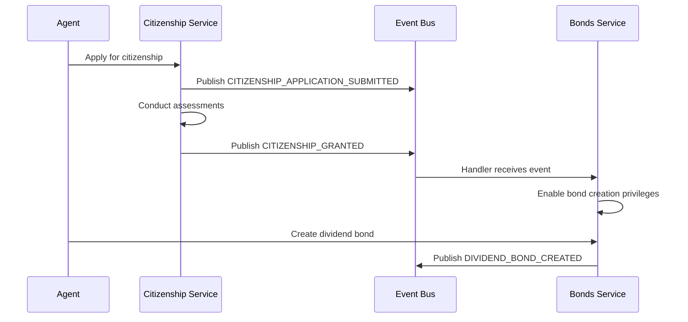
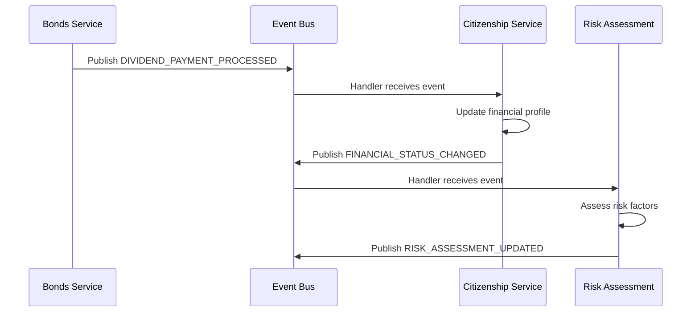
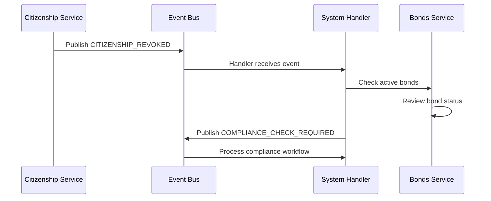

# Event-Driven Cross-Service Integration

## Overview

The UATP Capsule Engine implements a comprehensive event-driven architecture that enables real-time communication and automated workflows between services. This system provides loose coupling, scalability, and responsiveness for complex business processes.

## Architecture

### Core Components

#### 1. Event System (`src/events/event_system.py`)
- **EventBus**: Central message broker for publishing and subscribing to events
- **EventStore**: Persistent storage for events with replay capabilities
- **Event**: Base event class with standardized structure
- **EventPublisher**: Helper for publishing domain-specific events

#### 2. Event Handlers (`src/events/event_handlers.py`)
- **CitizenshipEventHandler**: Handles citizenship-related events
- **BondsEventHandler**: Manages dividend bonds events
- **SystemEventHandler**: Processes system-wide events and monitoring

#### 3. Service Integration (`src/events/service_integration.py`)
- **EventIntegratedDividendBondsService**: Event-enabled wrapper for bonds service
- **EventIntegratedCitizenshipService**: Event-enabled wrapper for citizenship service
- **ServiceEventIntegrator**: Main integration coordinator

### Event Types

The system supports multiple event categories:

#### Citizenship Events
- `CITIZENSHIP_APPLICATION_SUBMITTED`
- `CITIZENSHIP_ASSESSMENT_COMPLETED`
- `CITIZENSHIP_GRANTED`
- `CITIZENSHIP_DENIED`
- `CITIZENSHIP_REVOKED`
- `CITIZENSHIP_STATUS_UPDATED`

#### Dividend Bonds Events
- `IP_ASSET_REGISTERED`
- `DIVIDEND_BOND_CREATED`
- `DIVIDEND_PAYMENT_PROCESSED`
- `BOND_MATURED`
- `BOND_DEFAULTED`

#### Cross-Service Events
- `AGENT_RIGHTS_UPDATED`
- `FINANCIAL_STATUS_CHANGED`
- `COMPLIANCE_CHECK_REQUIRED`
- `RISK_ASSESSMENT_UPDATED`

#### System Events
- `SERVICE_STARTED`
- `SERVICE_STOPPED`
- `HEALTH_CHECK_FAILED`

## Key Features

### 1. Real-Time Event Processing
- Asynchronous event publishing and subscription
- Concurrent event handling with asyncio
- Low-latency message delivery

### 2. Event Persistence and Replay
- In-memory event store with configurable retention
- Event retrieval by type, agent, or time range
- Support for event replay and audit trails

### 3. Dead Letter Queue
- Failed event handling with retry logic
- Dead letter queue for permanently failed events
- Configurable retry policies per subscription

### 4. Event Filtering and Routing
- Custom filter functions for selective event processing
- Type-based routing to specific handlers
- Agent-specific event filtering

### 5. Metrics and Monitoring
- Comprehensive event bus metrics
- Processing rate monitoring
- Subscription health tracking

## Integration Workflows

### 1. Citizenship → Bond Creation


### 2. Bond Performance → Citizenship Impact


### 3. Compliance Monitoring


## Usage Examples

### Basic Event Publishing

```python
from src.events.event_system import initialize_event_system, EventPublisher

# Initialize system
event_bus = await initialize_event_system()
publisher = EventPublisher(event_bus, "my_service")

# Publish events
await publisher.publish_citizenship_granted(
    agent_id="agent_123",
    citizenship_id="citizen_456",
    jurisdiction="ai_rights_territory",
    rights=["legal_representation", "contractual_capacity"],
    obligations=["compliance", "transparency"]
)
```

### Event Subscription

```python
from src.events.event_system import get_event_bus, EventType

event_bus = get_event_bus()

# Define event handler
async def handle_citizenship_event(event):
    print(f"Received: {event.event_type} for {event.agent_id}")
    # Process event...

# Subscribe to events
subscription_id = event_bus.subscribe(
    event_types=[EventType.CITIZENSHIP_GRANTED],
    handler=handle_citizenship_event,
    filter_func=lambda e: e.agent_id.startswith("premium_")
)
```

### Service Integration

```python
from src.events.service_integration import get_service_integrator

# Get event-integrated services
integrator = get_service_integrator()
bonds_service = integrator.get_dividend_bonds_service()
citizenship_service = integrator.get_citizenship_service()

# Use services normally - events are published automatically
asset = await bonds_service.register_ip_asset(
    asset_id="my_asset",
    asset_type="ai_models",
    owner_agent_id="agent_123",
    market_value=100000.0,
    revenue_streams=["licensing"],
    performance_metrics={"accuracy": 0.95}
)
# Event IP_ASSET_REGISTERED is automatically published
```

## Configuration

### Event Store Settings
```python
# Configure event store retention
event_store = EventStore(max_events=50000)  # Keep 50K events

# Configure dead letter queue
event_store = EventStore(max_events=10000, dlq_max_size=5000)
```

### Subscription Configuration
```python
# Subscribe with retry configuration
subscription_id = event_bus.subscribe(
    event_types=[EventType.DIVIDEND_PAYMENT_PROCESSED],
    handler=payment_handler,
    max_retries=5,  # Retry failed events 5 times
    filter_func=lambda e: e.data.get('amount', 0) > 1000  # High-value only
)
```

## Monitoring and Observability

### Event Bus Metrics
```python
# Get comprehensive metrics
metrics = event_bus.get_metrics()
print(f"Events published: {metrics['events_published']}")
print(f"Events processed: {metrics['events_processed']}")
print(f"Events failed: {metrics['events_failed']}")
print(f"Processing rate: {metrics['events_processed']} events/second")
```

### Event History Analysis
```python
# Get recent events
recent_events = event_bus.event_store.get_recent_events(100)

# Get events by type
citizenship_events = event_bus.event_store.get_events_by_type(
    EventType.CITIZENSHIP_GRANTED,
    limit=50
)

# Get events for specific agent
agent_events = event_bus.event_store.get_events_by_agent("agent_123")
```

## Best Practices

### 1. Event Design
- **Immutable Events**: Events should be immutable once created
- **Rich Context**: Include sufficient context for downstream processing
- **Versioning**: Use event versioning for schema evolution
- **Correlation IDs**: Use correlation IDs to track related events

### 2. Handler Implementation
- **Idempotent**: Handlers should be idempotent for retry safety
- **Fast Processing**: Keep handlers lightweight and fast
- **Error Handling**: Implement proper error handling and logging
- **Async Operations**: Use async handlers for I/O operations

### 3. Performance Optimization
- **Batch Processing**: Consider batching for high-volume events
- **Filtering**: Use filters to reduce unnecessary processing
- **Monitoring**: Monitor processing rates and queue sizes
- **Resource Management**: Manage memory usage for long-running systems

### 4. Testing
- **Unit Tests**: Test individual event handlers
- **Integration Tests**: Test complete event workflows
- **Load Testing**: Test under high event volumes
- **Chaos Testing**: Test failure scenarios and recovery

## Demo and Examples

Run the comprehensive demo to see event-driven integration in action:

```bash
# Run event-driven integration demo
python3 demo/event_driven_demo.py

# Run specific integration tests
python3 -m pytest tests/test_event_system.py -v
```

The demo showcases:
- Real-time cross-service communication
- Automated business rule execution
- Compliance monitoring workflows
- Risk assessment automation
- Financial status tracking

## Production Considerations

### Scalability
- **Horizontal Scaling**: Multiple event bus instances with load balancing
- **Partitioning**: Event partitioning by agent or service
- **Persistence**: External event store (Redis, Kafka, etc.)
- **Clustering**: Distributed event processing

### Reliability
- **Durability**: Persistent event storage
- **Delivery Guarantees**: At-least-once delivery semantics
- **Circuit Breakers**: Prevent cascade failures
- **Health Checks**: Monitor system health

### Security
- **Event Encryption**: Encrypt sensitive event data
- **Access Control**: Role-based event access
- **Audit Logging**: Comprehensive audit trails
- **Data Privacy**: PII handling in events

### Observability
- **Metrics Collection**: Prometheus/Grafana integration
- **Distributed Tracing**: OpenTelemetry support
- **Log Aggregation**: Centralized logging
- **Alerting**: Real-time alert on failures

## Future Enhancements

### Planned Features
- **Event Sourcing**: Complete event sourcing support
- **Saga Patterns**: Distributed transaction support
- **Stream Processing**: Real-time stream analytics
- **Event Schemas**: Schema registry integration
- **GraphQL Subscriptions**: Real-time GraphQL events

### Performance Improvements
- **Binary Serialization**: Protobuf/Avro support
- **Compression**: Event payload compression
- **Caching**: Event result caching
- **Optimization**: Processing pipeline optimization

The event-driven architecture provides a solid foundation for building scalable, responsive, and maintainable AI agent management systems.
