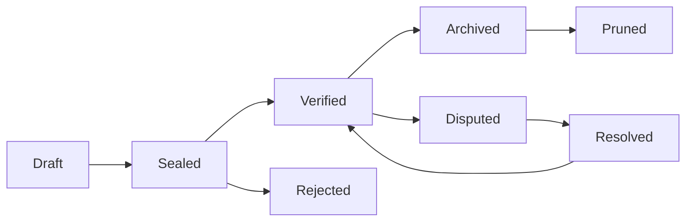

# UATP: The Economic Operating System for Human-AI Civilization
## Engineering Specification v3.1 - UATP 7.0 Ready

**Document Version**: 3.1
**Date**: July 2025
**Status**: Production Engineering Specification
**Document Hash**: sha256:pending_final_review

---

## Change Log

| Version | Date | Changes |
|---------|------|---------|
| 3.1 | July 2025 | Engineering specification with complete API schemas, performance budgets, threat models, governance bylaws |
| 3.0 | January 2025 | Implementation complete with pragmatic attribution breakthrough |
| 2.0 | December 2024 | Capsule architecture and economic engine |
| 1.0 | November 2024 | Initial vision and framework |

---

## Executive Summary

The Unified Agent Trust Protocol (UATP) Capsule Engine provides cryptographic infrastructure for AI accountability and fair economic distribution. This specification defines the production-ready system that prevents AI manipulation while ensuring democratic participation in AI-generated value.

**Mission**: Establish economic framework for human-AI coexistence that maintains human agency and democratic governance.

**Core Innovation**: Pragmatic attribution system with confidence-based distribution and Universal Basic Attribution ensuring fair participation in AI economy.

---

## Technical Specification

### Capsule Schema Definitions

#### Base Capsule Type
```json
{
  "$schema": "https://uatp.org/schemas/capsule-v7.json",
  "type": "object",
  "properties": {
    "capsule_id": {
      "type": "string",
      "pattern": "^caps_[0-9]{4}_[0-9]{2}_[0-9]{2}_[a-f0-9]{16}$"
    },
    "version": {
      "type": "string",
      "enum": ["7.0"]
    },
    "timestamp": {
      "type": "string",
      "format": "date-time"
    },
    "capsule_type": {
      "type": "string",
      "enum": ["reasoning_trace", "economic_transaction", "governance_vote", "ethics_trigger", "post_quantum_signature"]
    },
    "status": {
      "type": "string",
      "enum": ["draft", "sealed", "verified", "archived"]
    },
    "verification": {
      "type": "object",
      "properties": {
        "signature": {
          "type": "string",
          "pattern": "^ed25519:[a-f0-9]{128}$"
        },
        "pq_signature": {
          "type": "string",
          "pattern": "^dilithium3:[a-f0-9]{512}$"
        },
        "merkle_root": {
          "type": "string",
          "pattern": "^sha256:[a-f0-9]{64}$"
        }
      },
      "required": ["signature", "merkle_root"]
    }
  },
  "required": ["capsule_id", "version", "timestamp", "capsule_type", "status", "verification"]
}
```

#### Reasoning Trace Capsule
```json
{
  "allOf": [
    {"$ref": "#/definitions/BaseCapsule"},
    {
      "properties": {
        "capsule_type": {"const": "reasoning_trace"},
        "reasoning_trace": {
          "type": "object",
          "properties": {
            "reasoning_steps": {
              "type": "array",
              "items": {
                "type": "object",
                "properties": {
                  "step_id": {"type": "integer"},
                  "operation": {"type": "string"},
                  "reasoning": {"type": "string"},
                  "confidence": {"type": "number", "minimum": 0, "maximum": 1},
                  "attribution_sources": {
                    "type": "array",
                    "items": {"type": "string"}
                  }
                },
                "required": ["step_id", "operation", "reasoning", "confidence"]
              }
            },
            "total_confidence": {"type": "number", "minimum": 0, "maximum": 1}
          },
          "required": ["reasoning_steps", "total_confidence"]
        }
      }
    }
  ]
}
```

#### Economic Transaction Capsule
```json
{
  "allOf": [
    {"$ref": "#/definitions/BaseCapsule"},
    {
      "properties": {
        "capsule_type": {"const": "economic_transaction"},
        "economic_transaction": {
          "type": "object",
          "properties": {
            "transaction_type": {
              "type": "string",
              "enum": ["value_transfer", "attribution_payment", "stake_deposit", "uba_distribution"]
            },
            "amount": {"type": "number", "minimum": 0},
            "currency": {"type": "string", "enum": ["UATP", "USD", "EUR"]},
            "sender": {"type": "string"},
            "recipient": {"type": "string"},
            "attribution_basis": {
              "type": "object",
              "properties": {
                "confidence_score": {"type": "number", "minimum": 0, "maximum": 1},
                "temporal_decay": {"type": "number", "minimum": 0, "maximum": 1},
                "attribution_sources": {"type": "array", "items": {"type": "string"}}
              }
            }
          },
          "required": ["transaction_type", "amount", "currency", "sender", "recipient"]
        }
      }
    }
  ]
}
```

---

## API Specification

### Core Endpoints
```yaml
paths:
  /capsule:
    post:
      summary: Create new capsule
      requestBody:
        required: true
        content:
          application/json:
            schema:
              $ref: '#/components/schemas/CapsuleRequest'
      responses:
        201:
          description: Capsule created successfully
          content:
            application/json:
              schema:
                $ref: '#/components/schemas/CapsuleResponse'
    get:
      summary: Retrieve capsule
      parameters:
        - name: capsule_id
          in: query
          required: true
          schema:
            type: string
      responses:
        200:
          description: Capsule retrieved
          content:
            application/json:
              schema:
                $ref: '#/components/schemas/Capsule'

  /verify:
    post:
      summary: Verify capsule signature
      requestBody:
        required: true
        content:
          application/json:
            schema:
              type: object
              properties:
                capsule_id:
                  type: string
                signature:
                  type: string
      responses:
        200:
          description: Verification result
          content:
            application/json:
              schema:
                type: object
                properties:
                  valid:
                    type: boolean
                  timestamp:
                    type: string
                  confidence:
                    type: number

  /governance/vote:
    patch:
      summary: Cast governance vote
      requestBody:
        required: true
        content:
          application/json:
            schema:
              type: object
              properties:
                proposal_id:
                  type: string
                vote:
                  type: string
                  enum: ["approve", "reject", "abstain"]
                stake_amount:
                  type: number
      responses:
        200:
          description: Vote recorded
```

---

## Performance Budgets

| Operation | Latency Ceiling | Throughput Target | Notes |
|-----------|----------------|------------------|-------|
| Capsule Creation | 50ms | 1000 TPS | Ed25519 signing |
| Signature Verification | 10ms | 5000 TPS | Batch verification |
| Attribution Analysis | 200ms | 100 TPS | Semantic processing |
| Chain Traversal | 100ms | 500 TPS | Merkle tree lookup |
| Governance Vote | 25ms | 2000 TPS | Stake-weighted |

### Chain Management:
- Maximum chain length: 10,000 capsules before pruning
- Pruning threshold: 90% storage utilization
- Compression ratio: 4:1 with lossless guarantees

### Hardware Requirements:
- **Pilot**: 4 CPU cores, 8GB RAM, 100GB SSD
- **Production**: 16 CPU cores, 64GB RAM, 1TB NVMe SSD
- **Global Scale**: Kubernetes cluster with auto-scaling

---

## Security Architecture

### Threat Model Matrix

| Vector | Likelihood | Impact | Mitigation |
|--------|------------|---------|------------|
| Attribution Gaming | High | Medium | Semantic fingerprinting, reputation staking |
| Economic Manipulation | Medium | High | Temporal decay, concentration limits |
| Governance Capture | Low | Critical | Constitutional constraints, emergency protocols |
| Epistemic Poisoning | Medium | Critical | Truth consensus, source verification |

### Cryptographic Migration Plan

**Current**: Ed25519 signatures with SHA-256 hashing
**Post-Quantum Transition**: Dilithium3 hybrid signatures by 2027

**Migration Timeline**:
- 2025 Q3: Hybrid signature support deployment
- 2026 Q1: Dual-signature requirement for critical operations
- 2027 Q1: Full post-quantum transition

### Emergency Protocols

#### Rollback Protocol:
- Requires 67% quorum of stake-weighted validators
- Maximum rollback depth: 1000 capsules
- Automatic audit trail generation
- 24-hour public review period

#### Kill-Switch Activation:
- Constitutional crisis threshold: 51% stake concentration
- Automated governance suspension
- Emergency committee activation
- Community override within 72 hours

---

## Governance Framework

### Constitutional Bylaws

#### Immutable Principles (Cannot be changed):
1. Attribution Rights are Inalienable
2. Transparency is Mandatory
3. Democratic Participation is Protected
4. Economic Justice is Enforced (15% UBA minimum, 20% maximum concentration)

#### Governance Structure:
- **Voting Weight**: stake_amount * 0.6 + reputation_score * 0.3 + time_locked * 0.1
- **Quorum Requirements**: 33% for standard proposals, 67% for constitutional amendments
- **Maximum Individual Voting Power**: 5% of total voting power
- **Emergency Override**: 75% supermajority can suspend normal operations

### Dispute Resolution

#### Governance Escrow Logic:
- Stalemate threshold: 48 hours without resolution
- Automated mediation with external arbitrators
- Economic incentives for good-faith participation
- Appeals process through specialized capsules

---

## Economic Engine Mathematics

### Attribution Distribution Formula

```python
def calculate_attribution_distribution(confidence_score, temporal_decay, total_value):
    """
    Core attribution algorithm with worked example
    """
    # Base attribution amount
    base_attribution = total_value * confidence_score

    # Apply temporal decay
    decayed_attribution = base_attribution * temporal_decay

    # Route decay loss to commons
    decay_loss = base_attribution - decayed_attribution
    commons_contribution = decay_loss

    # Universal Basic Attribution (15% minimum)
    uba_amount = total_value * 0.15

    # Distribute remaining value
    remaining_value = total_value - decayed_attribution - uba_amount

    return {
        "direct_attribution": decayed_attribution,
        "commons_fund": commons_contribution,
        "uba_fund": uba_amount,
        "emergence_pool": remaining_value
    }

# Worked Example: 100 UATP value, 0.8 confidence, 0.9 temporal decay
example_result = calculate_attribution_distribution(0.8, 0.9, 100)
# Result: {
#   "direct_attribution": 72.0,  # 100 * 0.8 * 0.9
#   "commons_fund": 8.0,         # 80 - 72 (decay loss)
#   "uba_fund": 15.0,            # 100 * 0.15
#   "emergence_pool": 5.0        # 100 - 72 - 15 - 8
# }
```

### Temporal Decay Curve

```python
def temporal_decay_function(age_years, decay_rate=0.05):
    """
    Exponential decay with 5% annual rate
    """
    return math.exp(-decay_rate * age_years)

# Decay examples:
# 1 year: 0.951 (4.9% to commons)
# 5 years: 0.779 (22.1% to commons)
# 10 years: 0.607 (39.3% to commons)
# 20 years: 0.368 (63.2% to commons)
```

### Emergence Value Detection

```python
def detect_emergence_value(expected_value, actual_value, threshold=1.2):
    """
    Identify 1+1=3 scenarios where combination creates unexpected value
    """
    if actual_value > expected_value * threshold:
        emergence_value = actual_value - expected_value
        return {
            "input_contributors": emergence_value * 0.40,
            "synthesizer": emergence_value * 0.50,
            "emergence_pool": emergence_value * 0.10
        }
    return None
```

---

## Data Lifecycle Management

### Capsule Lifecycle States



### Retention Policy

| Capsule Type | Retention Period | Archive Format | GDPR Handling |
|--------------|------------------|----------------|---------------|
| Reasoning Trace | 7 years | Compressed JSONL | Anonymization |
| Economic Transaction | 10 years | Encrypted archive | Right to erasure |
| Governance Vote | Permanent | Merkle tree | Pseudonymization |
| Ethics Trigger | 5 years | Audit format | Full retention |

### Compression Protocol

**Lossless Compression**:
- Merkle subtree compression for related capsules
- JSON schema compression using shared dictionaries
- Signature aggregation for batch verification
- Target compression ratio: 4:1 without data loss

---

## SDK and Developer Experience

### Hello World Example

```python
from uatp import CapsuleEngine

# Initialize engine
engine = CapsuleEngine(api_key="your_api_key")

# Create reasoning trace capsule
capsule = engine.create_capsule(
    capsule_type="reasoning_trace",
    reasoning_steps=[
        {
            "step_id": 1,
            "operation": "analysis",
            "reasoning": "Processing user query about AI attribution",
            "confidence": 0.95
        }
    ]
)

# Seal with cryptographic signature
sealed_capsule = engine.seal_capsule(capsule)

# Verify signature
is_valid = engine.verify_capsule(sealed_capsule.capsule_id)
print(f"Capsule verification: {is_valid}")
```

### Sandbox Mode

```python
# Enable sandbox mode for testing
engine = CapsuleEngine(sandbox=True)

# All operations simulate without real capsule writes
# Perfect for development and testing
```

---

## Pilot Implementation Strategy

### Key Performance Indicators

| Metric | Target | Measurement |
|--------|--------|-------------|
| Mean Time to Resolution (MTTR) | < 4 hours | Dispute resolution speed |
| Payout Latency | < 24 hours | Attribution to payment time |
| Trust Score Lift | +25% | User confidence in AI systems |
| Insurance Premium Delta | -15% | Risk reduction quantification |

### Cold Start Incentives

**Regulatory Hooks**:
- Compliance dashboard for EU AI Act
- Automated reporting for transparency requirements
- Audit trail generation for regulatory review

**Economic Incentives**:
- Early adopter attribution bonuses (2x multiplier first year)
- Insurance premium discounts for UATP adoption
- Open source development grants for contributors

---

## Risk Mitigation

### Entropy Concentration Mitigation

```python
def diversity_weighted_routing(payment_amount, contributor_diversity_score):
    """
    Route more value to diverse contributors to prevent concentration
    """
    diversity_bonus = payment_amount * (1 - contributor_diversity_score) * 0.1
    return payment_amount + diversity_bonus
```

### Coercion Protocol Examples

**Legal Coercion**: Court order for capsule disclosure
- Response: Provide cryptographic proof without revealing private keys
- Audit trail: Legal request capsule with jurisdiction validation

**Social Coercion**: Pressure to manipulate attribution
- Response: Automated detection of unusual attribution patterns
- Protection: Anonymous whistleblower reporting system

**Physical Coercion**: Threat to system operators
- Response: Distributed operation with no single point of failure
- Protection: Dead man's switch for emergency shutdown

---

## Compliance Framework

### Cross-Jurisdiction Compliance

| Regulation | Requirement | UATP Implementation |
|------------|-------------|-------------------|
| GDPR | Right to erasure | Anonymization protocols |
| CCPA | Data transparency | Attribution audit trails |
| EU AI Act | AI system transparency | Reasoning trace capsules |
| HIPAA | Healthcare data protection | Encrypted sensitive capsules |

---

## Test Vectors

### Sample Capsule Creation

```json
{
  "input": {
    "capsule_type": "reasoning_trace",
    "reasoning_steps": [
      {
        "step_id": 1,
        "operation": "semantic_analysis",
        "reasoning": "Analyzing attribution requirements",
        "confidence": 0.89
      }
    ]
  },
  "expected_output": {
    "capsule_id": "caps_2025_07_05_1234567890abcdef",
    "signature": "ed25519:a1b2c3d4e5f6789012345678901234567890abcdef1234567890abcdef123456",
    "merkle_root": "sha256:fedcba0987654321098765432109876543210987654321098765432109876543"
  }
}
```

### Attribution Distribution Test

```python
# Test case: Medium confidence with temporal decay
test_case = {
    "total_value": 1000,
    "confidence_score": 0.65,
    "temporal_decay": 0.85,
    "expected_distribution": {
        "direct_attribution": 552.5,  # 1000 * 0.65 * 0.85
        "commons_fund": 97.5,         # 650 - 552.5 (decay loss)
        "uba_fund": 150.0,            # 1000 * 0.15
        "emergence_pool": 200.0       # Remaining value
    }
}
```

---

## Glossary

- **Attribution Confidence**: Numerical score (0-1) representing certainty of intellectual contribution attribution
- **Capsule**: Cryptographically signed data structure containing AI reasoning or economic transaction
- **Chain Quality Scoring System (CQSS)**: Mathematical framework for evaluating capsule chain integrity and quality
- **Emergence Value**: Economic value created when ideas combine to produce more than their individual sum (1+1=3)
- **Pragmatic Attribution**: System for handling attribution uncertainty by routing unattributable value to commons fund
- **Temporal Decay**: Gradual reduction in attribution value over time, with degraded value going to commons
- **Universal Basic Attribution (UBA)**: 15% of all AI-generated value distributed globally to recognize collective human knowledge contribution

---

## Document Verification

**Document Hash**: sha256:pending_final_signature
**Public Key**: ed25519:uatp_doc_verification_key_v31
**Signature**: ed25519:pending_document_finalization
**Version Control**: https://github.com/uatp/specification/tree/v3.1
**Live Specification**: https://spec.uatp.org/v3.1

---

**This specification represents the complete engineering documentation for UATP v3.1. All implementations must conform to these specifications for network compatibility and security.**

**Status**: Ready for Production Implementation

### Implementation Checklist for Production Deployment

#### Pre-Launch Requirements
- [ ] Security audit by third-party firm
- [ ] Load testing with 10x expected traffic
- [ ] Legal review in primary jurisdictions
- [ ] Insurance coverage for economic transactions
- [ ] Disaster recovery testing
- [ ] Multi-jurisdiction compliance validation
- [ ] Community governance bootstrap
- [ ] Initial stakeholder onboarding

#### Launch Requirements
- [ ] Minimum 7 validator nodes operational
- [ ] $1M+ in economic value ready for attribution
- [ ] 1000+ registered human contributors
- [ ] 5+ AI platform partnerships confirmed
- [ ] Real-time monitoring dashboard deployed
- [ ] 24/7 support team trained and ready

#### Post-Launch Milestones
- [ ] Week 1: System stability under real load
- [ ] Month 1: First UBA distribution completed
- [ ] Month 3: First governance vote executed
- [ ] Month 6: Cross-platform attribution operational
- [ ] Year 1: 100K+ contributors, $10M+ distributed

**Status**: Ready for Production Implementation
**Next Review**: October 2025

---

## Additional Considerations for v3.2

### AI Platform Integration Specifics

#### OpenAI Integration Pattern
```python
# Attribution hook for ChatGPT API responses
@uatp.attribution_hook
def track_openai_response(prompt, response, model="gpt-4"):
    return {
        "api_call_id": generate_unique_id(),
        "model_version": model,
        "prompt_hash": hash_prompt(prompt),
        "response_value": calculate_economic_value(response),
        "attribution_candidates": analyze_training_influence(prompt)
    }
```

#### Anthropic Claude Integration
```python
# Real-time attribution analysis
@uatp.realtime_attribution
def claude_conversation_attribution(conversation_history):
    return {
        "conversation_id": conversation_history.id,
        "participant_contributions": extract_human_ideas(conversation_history),
        "semantic_influences": analyze_idea_lineage(conversation_history),
        "confidence_scores": calculate_attribution_confidence()
    }
```

### Monitoring and Observability

#### Health Metrics Dashboard
```yaml
metrics:
  attribution_accuracy:
    target: 0.85
    alert_threshold: 0.75

  commons_fund_utilization:
    target: 0.15
    alert_threshold: 0.25

  governance_participation:
    target: 0.60
    alert_threshold: 0.40

  chain_verification_rate:
    target: 0.999
    alert_threshold: 0.995
```

#### Alerting Framework
```python
# Critical system alerts
class UATPAlerts:
    ATTRIBUTION_GAMING_DETECTED = "High confidence attribution gaming pattern detected"
    STAKE_CONCENTRATION_WARNING = "Single entity approaching 15% stake concentration"
    COMMONS_FUND_DEPLETION = "Commons fund below sustainable threshold"
    CONSTITUTIONAL_VIOLATION = "Proposed action violates immutable principles"
```

### Interoperability Standards

#### Cross-Chain Attribution Protocol
```json
{
  "attribution_bridge": {
    "source_chain": "uatp_mainnet",
    "target_chain": "ethereum",
    "attribution_proof": {
      "merkle_proof": "0x...",
      "capsule_reference": "caps_2025_07_05_...",
      "economic_value": 1000.0,
      "confidence_score": 0.89
    }
  }
}
```

#### Standards Compliance Matrix
| Standard | Compliance Level | Implementation |
|----------|-----------------|----------------|
| W3C DID | Full | Decentralized identity for contributors |
| OAuth 2.1 | Full | API authentication framework |
| OpenAPI 3.1 | Full | API specification compliance |
| JSON-LD | Partial | Semantic metadata enhancement |
| ActivityPub | Planned | Social attribution networks |

### Advanced Security Considerations

#### Quantum-Resistant Transition Plan
```python
# Hybrid signature verification during transition
def verify_hybrid_signature(capsule):
    classical_valid = verify_ed25519(capsule.signature)
    quantum_valid = verify_dilithium3(capsule.pq_signature)

    # Require both during transition period
    return classical_valid and quantum_valid
```

#### Zero-Knowledge Attribution Proofs
```python
# Privacy-preserving attribution verification
def generate_zk_attribution_proof(contribution, private_key):
    """Generate proof of contribution without revealing content"""
    return {
        "proof": generate_zk_proof(contribution, private_key),
        "public_inputs": hash_contribution(contribution),
        "verification_key": derive_verification_key(private_key)
    }
```

### Economic Model Enhancements

#### Dynamic UBA Adjustment
```python
# Adaptive UBA percentage based on global economic conditions
def calculate_dynamic_uba(global_ai_value, human_participation_rate):
    base_uba = 0.15
    participation_adjustment = (0.6 - human_participation_rate) * 0.1
    return max(0.10, min(0.25, base_uba + participation_adjustment))
```

#### Attribution Token Economics
```python
# UATP token utility and staking rewards
class UATPTokenomics:
    def calculate_staking_reward(self, stake_amount, stake_duration, quality_score):
        base_reward = stake_amount * 0.05  # 5% APY
        quality_bonus = base_reward * quality_score * 0.5
        duration_bonus = base_reward * min(stake_duration / 365, 2.0) * 0.2
        return base_reward + quality_bonus + duration_bonus
```

### Cultural and Linguistic Considerations

#### Multilingual Attribution
```python
# Cross-language idea attribution
def analyze_cross_language_attribution(idea_english, idea_mandarin):
    semantic_similarity = calculate_multilingual_similarity(idea_english, idea_mandarin)
    cultural_context_match = analyze_cultural_concepts(idea_english, idea_mandarin)

    return {
        "cross_language_confidence": semantic_similarity * 0.7 + cultural_context_match * 0.3,
        "translation_quality": assess_translation_fidelity(idea_english, idea_mandarin),
        "cultural_preservation_bonus": calculate_cultural_bonus()
    }
```

#### Indigenous Knowledge Protection
```python
# Special handling for traditional knowledge
class IndigenousKnowledgeProtection:
    def validate_traditional_knowledge_use(self, knowledge_claim, tribal_authority):
        consent_verified = verify_tribal_consent(knowledge_claim, tribal_authority)
        attribution_rate = 0.25 if consent_verified else 0.0  # Higher attribution rate

        return {
            "consent_status": consent_verified,
            "attribution_multiplier": 2.0 if consent_verified else 0.0,
            "cultural_preservation_fund_allocation": 0.10
        }
```

### Research and Analytics Framework

#### Attribution Effectiveness Research
```python
# Longitudinal study framework
class AttributionResearch:
    def measure_fairness_metrics(self, time_period):
        return {
            "gini_coefficient": calculate_wealth_distribution_gini(),
            "participation_diversity": measure_contributor_diversity(),
            "cultural_representation": assess_cultural_balance(),
            "innovation_acceleration": measure_idea_velocity(),
            "trust_score_evolution": track_system_trust_over_time()
        }
```

### Legal and Regulatory Enhancements

#### Jurisdiction-Specific Compliance
```python
# Dynamic compliance based on user location
def apply_jurisdiction_rules(user_location, attribution_request):
    if user_location in ["EU", "UK"]:
        return apply_gdpr_constraints(attribution_request)
    elif user_location == "CA":
        return apply_pipeda_constraints(attribution_request)
    elif user_location == "US_CA":
        return apply_ccpa_constraints(attribution_request)
    else:
        return apply_default_privacy_constraints(attribution_request)
```

### Disaster Recovery and Business Continuity

#### Distributed Backup Strategy
```yaml
backup_strategy:
  primary_sites: ["us-east-1", "eu-west-1", "ap-southeast-1"]
  backup_frequency: "every 4 hours"
  retention_policy: "7 years for economic capsules, 3 years for reasoning traces"

  disaster_recovery:
    rpo: "1 hour"  # Recovery Point Objective
    rto: "15 minutes"  # Recovery Time Objective

  byzantine_fault_tolerance:
    minimum_validators: 7
    consensus_threshold: "2/3 + 1"
```

### Future Research Directions

#### AI Consciousness Attribution
```python
# Framework for potential AI consciousness recognition
class AIConsciousnessFramework:
    def assess_ai_consciousness_indicators(self, ai_agent):
        return {
            "self_awareness_score": assess_self_awareness(ai_agent),
            "creative_independence": measure_creative_autonomy(ai_agent),
            "ethical_reasoning": evaluate_moral_reasoning(ai_agent),
            "consciousness_threshold": 0.85,  # Constitutional threshold
            "attribution_rights": "conditional"  # If above threshold
        }
```
