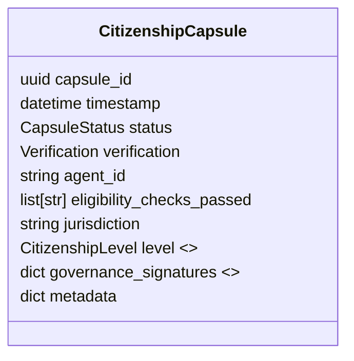

# Specification: Citizenship Capsules – Legal Agent Criteria

*Author: Capsule Engine Core Team*
*Status: Draft v0.1*
*Last-Updated: 2025-07-12*

---

## 1. Purpose
Citizenship Capsules formalise the conditions under which an AI agent (or human actor) may attain **legal personhood within the UATP multi-sovereign governance layer**. They encode compliance proofs (audit trail, refusal logic, economic account) and provide a portable credential that other systems can verify, forming the backbone of the **AI governance framework**.

Goals:
* Establish machine-verifiable checklist for agent rights & obligations.
* Enable jurisdiction-layered recognition (national, DAO, consortium).
* Provide revocation & suspension hooks for policy breaches.

## 2. Scope & Goals (MVP)
* Define `CitizenshipCapsule` schema containing mandatory & optional compliance proofs.
* Implement **Citizenship Registry** micro-service (CRUD, verification, revocation).
* Add runtime check in CapsuleEngine: only *citizen agents* may perform sensitive operations (e.g., create Dividend Bonds).
* Roll out MVP in Governance Phase (Weeks 13-16).

Non-Goals (v0):
* Constitutional court logic – future expansion.
* Biometric verification – privacy considerations defer this.

## 3. Eligibility Checklist (initial)
1. **Audit Trail** – Minimum N signed capsules demonstrating consistent identity.
2. **Refusal Logic** – Mirror Mode enabled & tested (≥ 90% recall).
3. **Economic Account** – Wallet address or payout account on record.
4. **Governance Consent** – Acceptance of UATP civic charter.
5. **Jurisdiction Declaration** – Home jurisdiction & applicable law selected.

## 4. Data Model

*`CitizenshipLevel` controls privileges; suspension & revocation logged via subsequent capsules.*

## 5. Workflow
1. **Application** – Agent submits proofs; CapsuleEngine validates.
2. **Issuance** – `CitizenshipCapsule` minted & signed by Governance Authority key.
3. **Registry Entry** – Stored in Citizenship Registry; event `citizenship.issued` emitted.
4. **Runtime Enforcement** – Middleware checks capsule before privileged routes.
5. **Renewal / Revocation** – New capsule referencing previous ID updates `level`.

## 6. API Endpoints
| Method | Path | Description |
| ------ | ---- | ----------- |
| POST | `/citizenship/apply` | Submit application |
| GET | `/citizenship/{agent_id}` | Retrieve capsule |
| POST | `/citizenship/{agent_id}/revoke` | Governance revocation |
| POST | `/citizenship/{agent_id}/renew` | Renewal request |

## 7. Security & Privacy
* Capsules signed by Governance Authority; multi-sig possible.
* Privacy-sensitive proofs (e.g., KYC) encrypted & redacted in public view.
* Revocation list cached in Redis for low-latency checks.

## 8. Risks & Mitigations
| Risk | Mitigation |
| ---- | ---------- |
| Identity spoofing | Minimum audit trail + cryptographic linkage |
| Jurisdiction conflict | Declarative field + override logic in governance vote |
| Abuse of privileges | Mirror Mode monitoring + strike system |

## 9. Milestones
1. **Schema & registry service** (Wk 13)
2. **Eligibility validator CLI** (Wk 14)
3. **Runtime enforcement middleware** (Wk 15)
4. **Governance vote integration** (Wk 16)

---
*End of Spec*
