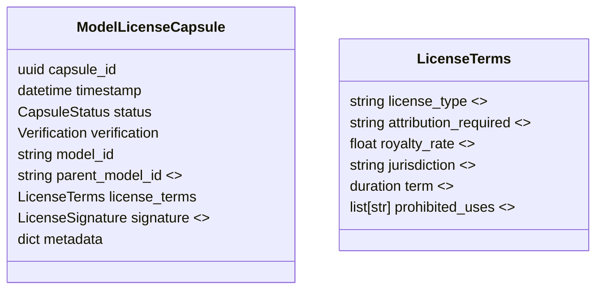

# Specification: Cloning Rights – Moral Model Licensing

*Author: Capsule Engine Core Team*
*Status: Draft v0.1*
*Last-Updated: 2025-07-12*

---

## 1. Purpose
Cloning Rights introduce a **licensing capsule** that travels with every fine-tuned or derived AI model, codifying the moral and economic rights of the original model owner (human or organization). This ensures **personal sovereignty & intellectual property (IP)** are preserved even when a model is cloned, compressed or further fine-tuned by third parties.

Key outcomes:
* Transparent, machine-readable licences attached to model artefacts.
* Automated enforcement via runtime checks in the LLM Registry and Capsule Engine.
* Support for downstream royalty splits, refusal logic and provenance queries.

## 2. Scope & Goals
* Define a **`ModelLicenseCapsule`** schema and persistence workflow.
* Extend the **LLM Registry** to require a valid license capsule for any registered model.
* Provide core licence types (permissive, reciprocal, non-commercial, revenue-share).
* Implement an enforcement hook in `CapsuleEngine.create_capsule_from_prompt_async` that validates the calling model’s licence compatibility.
* MVP delivered in Phase-2 *Foundation* (Weeks 3-4) to unblock multi-provider onboarding.

Non-Goals (v0):
* On-chain licence notarisation – left for later governance phase.
* Automatic legal text generation – out of scope.

## 3. Data Model


*Each model in the registry stores a pointer to its `ModelLicenseCapsule`*.

## 4. Workflow
1. **Registration** – When a model is uploaded, the submitter posts a `ModelLicenseCapsule` containing licence terms & signature.
2. **Validation** – Registry verifies:
   * Capsule signature (cryptographic proof of owner).
   * Licence type is allowed by platform policy.
3. **Runtime Enforcement** – Before a prompt is routed to a model, the engine checks:
   * Caller’s usage intent vs `prohibited_uses`.
   * Whether attribution headers need injection.
   * If revenue-share: logs usage event for royalty calculation.
4. **Propagation** – When a derived model is published, linkage to `parent_model_id` ensures ancestral royalty routing.

## 5. API Extensions
| Method | Path | Description |
| ------ | ---- | ----------- |
| POST | `/models/{id}/license` | Upload or update a license capsule |
| GET | `/models/{id}/license` | Retrieve license capsule |
| GET | `/models/{id}/license/validate?intent=xyz` | Vet intended use against licence rules |
| POST | `/models/{id}/license/accept` | Record acceptance (for audit) |

## 6. Enforcement Logic (Pseudo-code)
```python
async def check_license(model_id: str, intent: str):
    capsule = await registry.get_license_capsule(model_id)
    if not capsule:
        raise LicenseError("Model lacks a valid license capsule")
    terms = capsule.license_terms
    if intent in terms.prohibited_uses:
        raise LicenseError("Prohibited use under current license")
    if terms.license_type == "NonCommercial" and is_commercial(intent):
        raise LicenseError("Commercial intent requires re-licensing")
    return True
```
This function is referenced inside `CapsuleEngine.create_capsule_from_prompt_async` before dispatch.

## 7. Security & Privacy
* License capsules signed with Ed25519 using the owner’s `MODEL_SIGNING_KEY`.
* Stored in encrypted column (`pgp_sym_encrypt`) for sensitive fields (jurisdiction, revenue split).
* Verification key published for public audit.

## 8. Risks & Mitigations
| Risk | Mitigation |
| ---- | ---------- |
| Licence spoofing | Cryptographic signatures + registry verification |
| Fork without licence | Enforcement at runtime; refusal capsule emitted |
| Jurisdictional conflict | `LicenseTerms.jurisdiction` flag + legal advisory service |
| Royalty evasion | Capsule-level audit logs & Dividend Engine cross-checks |

## 9. Milestones
1. **Schema + capsule class** (Wk 3)
2. **Registry validation hooks** (Wk 3)
3. **Runtime enforcement integration** (Wk 4)
4. **End-to-end test suite (pytest)** (Wk 4)

---
*End of Spec*
