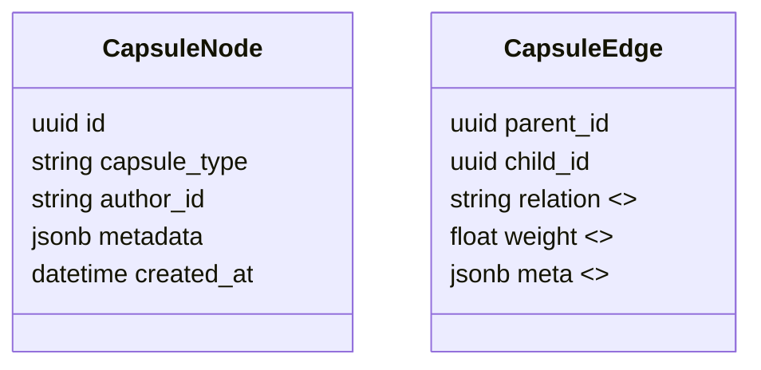

# Specification: Constellations – Causal Graph Memory

*Author: Capsule Engine Core Team*
*Status: Draft v0.1*
*Last-Updated: 2025-07-12*

---

## 1. Purpose
Constellations provide **global system intelligence** by materialising every capsule’s causal lineage into a queryable, evolving **causal graph memory**.  This enables:

* Transparent influence tracking across all capsules and agents
* Efficient dividend routing through capsule ancestry paths
* Advanced analytics (e.g., value drift, dependency hotspots, governance impact)
* Foundation for real-time reasoning optimisation (e.g., pruning redundant chains)

## 2. Scope & Goals
* Represent the full capsule DAG (Directed Acyclic Graph) in a fast, distributed store
* Support low-latency queries such as `ancestors(capsule_id)`, `descendants(capsule_id)`, `shortest_path(a,b)`
* Expose programmable GraphQL & REST APIs
* Provide summarisation & pruning strategies to manage graph bloat
* Integrate with Dividend Engine for value propagation
* Ship an MVP within Phase 2 *Foundation* window (Weeks 1-4)

Non-Goals (v0):
* Visualisation UI (handled later by Capsule Visualiser)
* On-chain / ZK storage – we mock these for now

## 3. Functional Overview
```
┌──────────────┐   write/update   ┌───────────────┐
│ Capsule SDK  ├─────────────────▶│  Graph Store  │
└──────────────┘                  └───────────────┘
       ▲                                   │
       │ query                             │ pub/sub events
       │                                   ▼
┌──────────────┐                  ┌────────────────┐
│   Services   │◀─────────────────┤  Stream Topic   │
└──────────────┘   async ingest   └────────────────┘
```

1. **Ingestion Pipeline** – every time a capsule is committed, the engine serialises a `CapsuleEdge` event with parent/child IDs and metadata.
2. **Graph Store** – a pluggable backend (initially Neo4j; roadmap: Dgraph, Gremlin) that maintains node/edge entities plus graph-level indices.
3. **Query API** – micro-service exposing GraphQL/REST endpoints & gRPC for internal calls.
4. **Change-Feed** – Kafka topic mirrors mutations so downstream services (Dividend Engine, Visualiser) stay in sync.

## 4. Data Model (MVP)


## 5. API Endpoints
| Method | Path | Description |
| ------ | ---- | ----------- |
| GET | `/capsule/:id/ancestors?depth=N` | Ancestor list up to depth N |
| GET | `/capsule/:id/descendants?depth=N` | Descendant list |
| GET | `/capsule/:id/lineage` | Full lineage path to genesis |
| POST | `/capsule/edges` | Bulk edge ingest (internal) |
| POST | `/capsule/summarise` | Trigger summarisation routine |

Schema definitions live in `openapi/constellations.yaml` (to be added).

## 6. Storage, Pruning & Summarisation
* **Pruning Rules** (configurable):
  * Collapse edges older than *T* days with <ε dividend weight into a super-node
  * Archive cold subgraphs to object storage (S3/MinIO) using Parquet snapshots
* **Summaries** are kept as *shadow nodes* containing stats (e.g., total descendants, cumulative value).
* **TTL** is never destructive—archived snapshots are reversible.

## 7. Security & Privacy
* Access control via CapsuleEngine JWT scopes (`graph:read`, `graph:write`).
* Sensitive capsule metadata fields are hashed/enc-ref by default.
* Audit events recorded in Governance Ledger.

## 8. Performance Targets
* Ingestion throughput ≥ **5k edges/sec** sustained on commodity 4-core instance.
* P99 query latency ≤ **150 ms** for ancestor lookup depth = 6 (1 million-node graph).

## 9. Risks & Mitigations
| Risk | Mitigation |
| ---- | ---------- |
| Graph bloat | Pruning & summarisation rules; sharding backend |
| Network partition causing divergent state | Periodic consistency jobs + CRDT patterns |
| Neo4j license constraints | Abstraction layer allows FOSS backends |
| Data privacy leakage | Field-level encryption & ACLs |

## 10. Milestones & Acceptance
1. **Schema & API stub** (Wk 1)
2. **Neo4j PoC with 100 k nodes** + basic queries (Wk 2)
3. **Ingestion Pipeline integrated** (Wk 3)
4. **Pruning/summarisation job** + benchmarks (Wk 4)
5. **MVP Review & sign-off** – All core tests pass, metrics achieved.

---
*End of Spec*
