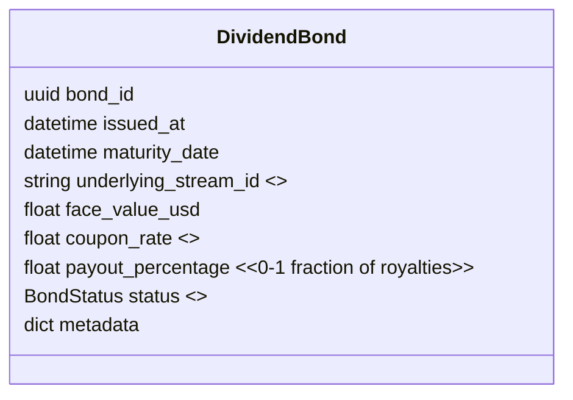

# Specification: Dividend Bonds – IP Yield Instruments

*Author: Capsule Engine Core Team*
*Status: Draft v0.1*
*Last-Updated: 2025-07-12*

---

## 1. Purpose
Dividend Bonds convert future royalty streams from licensed capsules or models into **token-like yield instruments** that can be traded or pledged as collateral. They form the financial layer connecting attribution flows to capital markets, thus enabling **financialisation of memory**.

Key capabilities:
* Off-chain issuance & settlement (Phase-2 MVP) with optional on-chain wrapper (later phase).
* Time-bound yield claims backed by the Capsule Dividend Engine.
* Built-in compliance guardrails (KYC/AML, accredited investor checks).

## 2. Scope & Goals
* Implement `DividendBond` entity in the economic module and persistence schema.
* Build **Bond Issuer Service** that packages a basket of future royalties into a bond.
* Integrate with **Capsule Dividend Engine** to route a percentage of payouts to bond holders.
* Provide REST & GraphQL endpoints for issuance, transfer, redemption and status.
* MVP delivered in Economic Attribution Phase (Weeks 9-12).

## 3. Data Model

## 4. Workflow
1. **Valuation** – Bond Issuer calculates expected royalties from `underlying_stream_id` over term; sets `face_value` and `coupon_rate`.
2. **Issuance** – Creates `DividendBond`, signs with issuer key; stores in DB; emits `bond.issued` event.
3. **Distribution** – Bonds allocated to investors; transfers logged in `bond_transfers` table.
4. **Payout** – Each royalty cycle, Dividend Engine splits flow: `payout_percentage` → current bond holder, rest → original owners.
5. **Maturity** – On `maturity_date`, bond status → `Redeemed`; residual flow reverts to owner.

## 5. API Endpoints
| Method | Path | Description |
| ------ | ---- | ----------- |
| POST | `/bonds` | Issue new bond |
| GET | `/bonds/{id}` | Retrieve bond details |
| POST | `/bonds/{id}/transfer` | Transfer bond ownership |
| GET | `/bonds/{id}/payouts` | List historical payouts |
| POST | `/bonds/{id}/redeem` | Manual redemption (if early) |

## 6. Compliance & Security
* KYC/AML enforced via `compliance` module before transfer.
* Bonds hashed & signed (`bond.signature`) to prevent tampering.
* Optional on-chain anchor (ERC-1400 like) in Governance Phase.

## 7. Risks & Mitigations
| Risk | Mitigation |
| ---- | ---------- |
| Royalty shortfall | Over-collateralisation reserve; disclosure docs |
| Regulatory breach | Jurisdiction tag + compliance checks |
| Market illiquidity | Internal marketplace & buy-back facility |

## 8. Milestones
1. **Schema + issuer service** (Wk 9)
2. **Dividend Engine router update** (Wk 10)
3. **Compliance integration** (Wk 11)
4. **E2E test suite & docs** (Wk 12)

---
*End of Spec*
