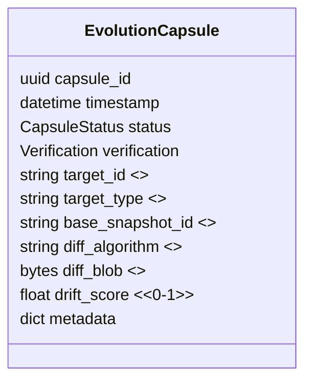

# Specification: Evolution Capsules – Tracking Value Drift

*Author: Capsule Engine Core Team*
*Status: Draft v0.1*
*Last-Updated: 2025-07-12*

---

## 1. Purpose
Evolution Capsules provide a **temporal snapshot & diff mechanism** that records _how_ a capsule, model or policy evolves over time. They deliver **transparency in growth** and enable auditors, owners and downstream users to quantify _value drift_ and motivation shifts.

Key benefits:
* Immutable history of critical artefacts (capsules, licences, policies).
* Automated diff calculations surfaced to governance dashboards.
* Inputs for Dividend Engine to adjust royalty rates based on drift.

## 2. Scope & Goals
* Define `EvolutionCapsule` schema capable of referencing any prior capsule (or model) and storing an encoded diff payload.
* Build a _Snapshot Service_ that periodically captures the chosen artefacts (e.g., every 24 h or on material change).
* Implement diff functions: JSON structural diff, model weight hash diff, policy rule diff.
* Expose `/evolution/*` API endpoints for retrieval and comparison.
* MVP completed in Phase-2 *Foundation* Week 4 (after Constellations).

Non-Goals:
* Data-intensive weight diff visualisation – left for visualiser phase.
* Smart-contract anchoring – reserved for later governance.

## 3. Data Model

*`drift_score` is a normalised metric (0 = identical, 1 = max drift) calculated by the chosen algorithm.*

## 4. Snapshot & Diff Pipeline
1. **Snapshot** – Serialize target artefact → store immutable copy (`SnapshotStore`).
2. **Diff** – Compute delta between new snapshot and previous baseline.
3. **Capsule** – Package diff + metadata into `EvolutionCapsule`; sign & store via `CapsuleEngine`.
4. **Publish** – Emit Kafka `evolution.events` for subscribers (Visualizer, Dividend Engine).

## 5. Algorithms
* **JSON diff** – Use `deepdiff` library → produce concise patch; drift score = (#changes / total_nodes).
* **Weights diff** – Hash each tensor → Hamming distance of hashes; drift score = mean layer delta.
* **Policy diff** – AST diff of rule DSL; drift score = (#changed nodes / total_nodes).

## 6. API Endpoints
| Method | Path | Description |
| ------ | ---- | ----------- |
| GET | `/evolution/{target_id}` | List all evolution capsules for target |
| GET | `/evolution/{capsule_id}` | Retrieve specific evolution capsule |
| GET | `/evolution/{target_id}/compare?from=a&to=b` | On-the-fly diff & score |

## 7. Security & Privacy
* Snapshot blobs encrypted at rest (AES-GCM); keys in KMS.
* Diff blobs compressed & encrypted before storage.
* Access control: `evolution:read` scope.

## 8. Risks & Mitigations
| Risk | Mitigation |
| ---- | ---------- |
| Storage growth | Cold-archive snapshots older than N days to S3 Glacier |
| Expensive diff on large models | Async worker pool + caching |
| Malicious drift tampering | Capsule signature & hash verification |

## 9. Milestones
1. **Schema + snapshot store** (Wk 4)
2. **Diff library integrations** (Wk 4)
3. **Capsule generation cronjob** (Wk 4)
4. **REST endpoints + tests** (Wk 4)

---
*End of Spec*
